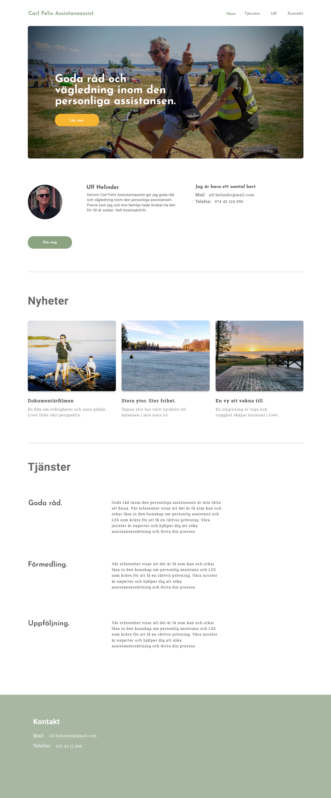

---
title: 'En ny webbplats och CMS'
subtitle: ''
date: '2019-06-01'
image: 'cf_header.png'
case: 'Webbplats - Carl felix Assistansassist'
resultat: 'Design och CMS'
webbplatsen: 'Kommer snart'
---

<h2 class="label-1">Case</h2>

Ulf Helinder har sedan 30 år tillbaka en son med autism och utvecklingsstörning vilket lett till att Ulf inte bara är väldigt engagerad i sin sons liv utan också vill hjälpa andra i samma situation som han står i idag, liksom för trettio år sedan.

Carl Felix Assistansassist är en ny webbplats där Ulf Helinder kan nå ut med sin gedigna kunskap inom autism och allt som rör den personlig assistansen.

<h2 class="label-1">Lösningen</h2>

Ulf kom till mig med ett redan färdigdesignat flygblad och önskade en ny webbplats på samma tema. Tillsammans med ledorden, enkel, trygghet och förtroende, designade jag med flygbladet som grund webbplatsen.

Den tekniska lösningen är byggd med Gatsby JS i kombination med Netlify som host och Netlify CMS, som just CMS.

